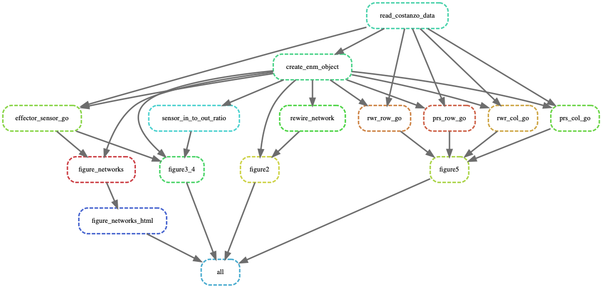

enm
==============================

Elastic network model of the cell and identification of sensor and effector genes
doi: this will be updated

Project Organization
------------

    ├── LICENSE
    ├── Snakefile          <- Snakemake with rules to create intermediate data and figures from raw data 
    ├── Snakefile_with_supp<- Snakemake with rules to create figures from intermediate data
    ├── README.md          <- The top-level README for people using this project.
    ├── data
    │   ├── supp           <- Intermediate data that has been transformed and used for figure generation.
    │   └── raw            <- The original, immutable data dump.
    ├── docs               <- A default Sphinx project; see sphinx-doc.org for details
    │
    ├── notebooks          <- Jupyter and/or Rmarkdown notebooks for figure generation.
    │
    ├── reports            <- Folder to re-generate notebooks as HTML, PDF, LaTeX, etc.
    │   └── figures        <- Figures used in the paper 
    ├── reports_done       <- Generated notebooks as HTML, PDF, LaTeX, etc.
    │
    ├── enm_snakemake.yml  <- The environment file for reproducing the analysis conda environment. Used for python scripts in Snakemake
    ├── r_env.yml          <- The environment file for reproducing the analysis conda environment. Used for R scripts in Snakemake
    │
    ├── setup.py           <- makes project pip installable (pip install -e .) so enm can be imported
    ├── enm                <- Source code for use in this project.
    │   ├── __init__.py    <- Makes enm a Python module
    │   ├── Enm.py         <- Contains Enm class and related functions 
    │   ├── visualize.py   <- Makes enm a Python module
    │   ├── utils.py       <- Contains functions that have been used in this project 
    │
    ├── scripts            <- Contains scripts to generate intermediate data/results. All scripts could be run with Snakemake 
    └── tox.ini            <- tox file with settings for running tox; see tox.readthedocs.io


--------

This repo contains a Snakefile and thus all pipeline can be run using Snakemake. 

Snakemake will use the raw data provided under `data/raw` to generate all intermediate data and results for figure generation.

Raw data could be downloaded from `https://thecellmap.org/costanzo2016/data_files/Genetic%20interaction%20profile%20similarity%20matrices.zip`

The Rmarkdown and Jupyter notebooks under `notebooks` directory can be used to create the figures in the paper. The html files for those notebooks are shared under `reports_done` folder. A rerun of snakemake pipeline will create `html` files to `reports` folder.

To re-create the figures/reports starting from raw data, first create a conda environment and install snakemake:

```bash
conda create -n enm_package_env
conda activate enm_package_env
conda install snakemake
```

Then run snakemake:

```bash
snakemake -j10 --use-conda --conda-frontend conda all
```

This will run rules based on the following DAG:


`--use-conda --conda-frontend` directive will download and install necessary packages and run the scripts in a conda environment for both python/jupyter and r/rmarkdown files. Figure 2 and Figure 5 dependencies will take longer to run, depending on cpu and number of cores. I don't suggest running them blindly. 

Alternatively, it is also possible to use interim data generated in the project to regenerate figures. `Snakefile_with_supp` will use data available in `data/supp` folder to regenerate Figure2 to Figure 5, except network figures.

```bash
snakemake -s Snakefile_with_supp -j10 --use-conda --conda-frontend conda 
```

Finally, one can also create a conda environment with following, change the input file names in scripts and notebooks manually and run them manually. This is not suggested.

```bash
conda env create -n enm_package_env -f enm_snakemake.yml
```

<p><small>Project based on the <a target="_blank" href="https://drivendata.github.io/cookiecutter-data-science/">cookiecutter data science project template</a>. Though many edits were applied. #cookiecutterdatascience</small></p>
